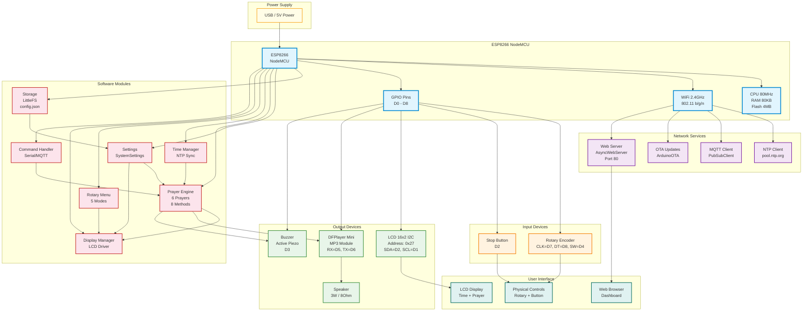

# ESP Prayer System - Block Diagram

---

## Legend

| Color | Category |
|-------|----------|
| 🔵 Blue | ESP8266 MCU (Central Controller) |
| 🟠 Orange | Input Devices |
| 🟢 Green | Output Devices |
| 🟣 Purple | Network Services |
| 🔴 Red | Software Modules |
| 🟤 Teal | User Interfaces |
| 🟡 Yellow | Power Supply |
