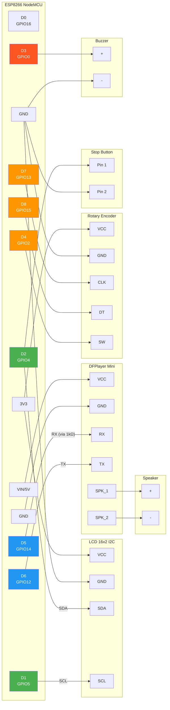
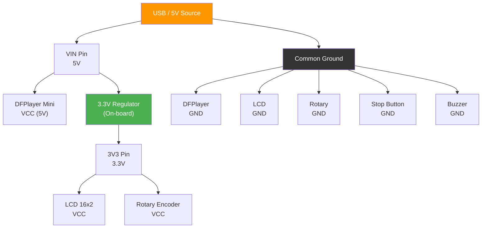
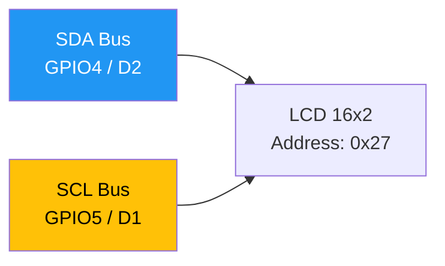
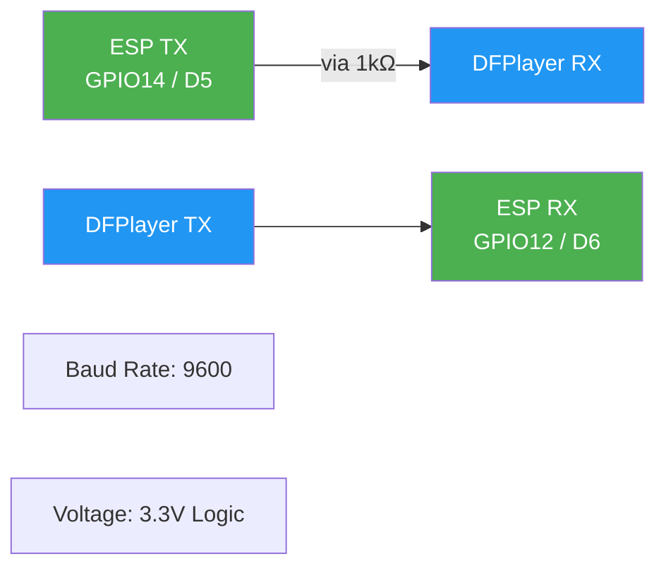

# ESP Prayer System - Connection Map

## 1. Complete Wiring Diagram



## 2. Pin Assignment Table

| Pin | GPIO | Component | Function | Wire Color |
|-----|------|-----------|----------|------------|
| D0 | GPIO16 | - | Not Used | - |
| **D1** | GPIO5 | LCD 16x2 | I2C SCL | 🟡 Yellow |
| **D2** | GPIO4 | LCD 16x2 | I2C SDA | 🔵 Blue |
| **D2** | GPIO4 | Stop Button | Digital Input | 🟣 Purple |
| **D3** | GPIO0 | Buzzer | PWM Output | 🟠 Orange |
| **D4** | GPIO2 | Rotary Encoder | SW (Button) | 🟠 Orange |
| **D5** | GPIO14 | DFPlayer Mini | RX (via 1kΩ) | 🟢 Green |
| **D6** | GPIO12 | DFPlayer Mini | TX | 🟢 Green |
| **D7** | GPIO13 | Rotary Encoder | CLK | 🟠 Orange |
| **D8** | GPIO15 | Rotary Encoder | DT | 🟠 Orange |
| RX | GPIO3 | Serial Monitor | Debug Output | - |
| TX | GPIO1 | Serial Monitor | Debug Input | - |
| 3V3 | - | LCD, Rotary | Power (3.3V) | 🔴 Red |
| VIN | - | DFPlayer | Power (5V) | 🔴 Red |
| GND | - | All Components | Ground | ⚫ Black |

## 3. Power Distribution



## 4. I2C Bus



## 5. Software Serial (DFPlayer)



---

## Quick Reference

```
┌─────────────────────────────────────────────────┐
│              ESP8266 NodeMCU                    │
│                                                 │
│  3V3 ──┬──┬────────────────────── GND ──┬──┬──  │
│        │  │                             │  │    │
│  D0    │  │ (Not Used)            A0    │  │    │
│        │  │                             │  │    │
│  D1 ───┼──┼──── LCD SCL                 │  │    │
│        │  │                             │  │    │
│  D2 ───┼──┼──── LCD SDA                 │  │    │
│        │  │     Stop Button             │  │    │
│        │  │                             │  │    │
│  D3 ───┼──┼──── Buzzer (+)              │  │    │
│        │  │                             │  │    │
│  D4 ───┼──┼──── Rotary SW               │  │    │
│        │  │                             │  │    │
│  D5 ───┼──┼──── DFPlayer RX (1kΩ)       │  │    │
│        │  │                             │  │    │
│  D6 ───┼──┼──── DFPlayer TX             │  │    │
│        │  │                             │  │    │
│  D7 ───┼──┼──── Rotary CLK              │  │    │
│        │  │                             │  │    │
│  D8 ───┼──┼──── Rotary DT               │  │    │
│        │  │                             │  │    │
│  RX    │  │ (Serial Debug)         TX   │  │    │
│        │  │                             │  │    │
└────────┴──┴─────────────────────────────┴──┴──┘
         │  │                             │  │
         │  └──── 3.3V Power ────────────┘  │
         └──── 5V (VIN) ────────────────────┘
```
