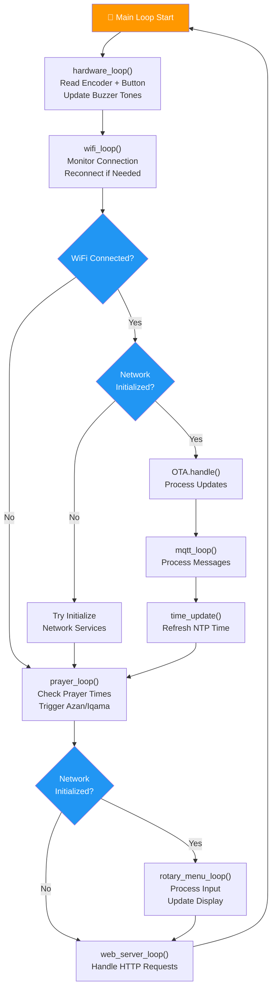
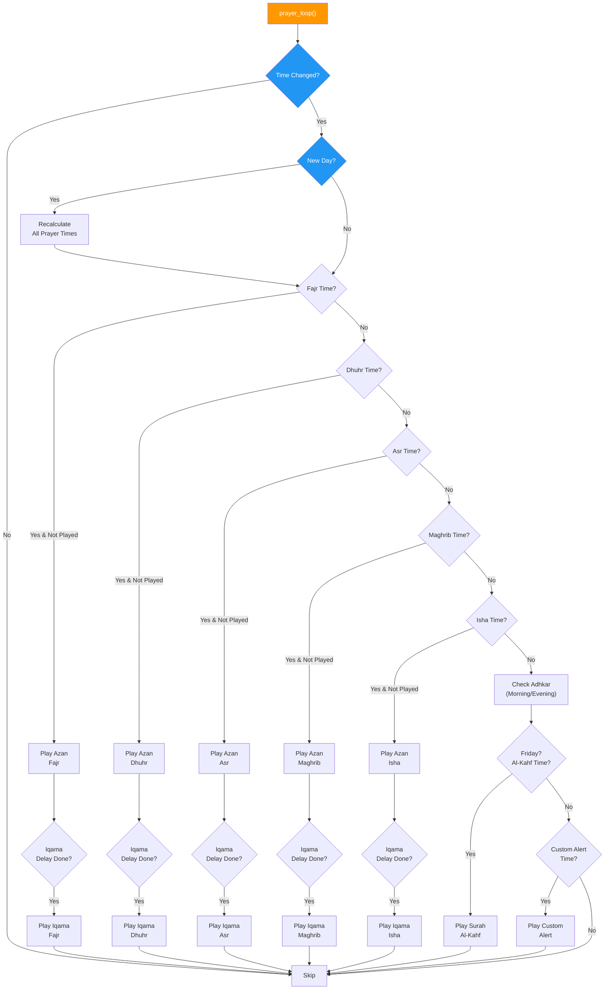
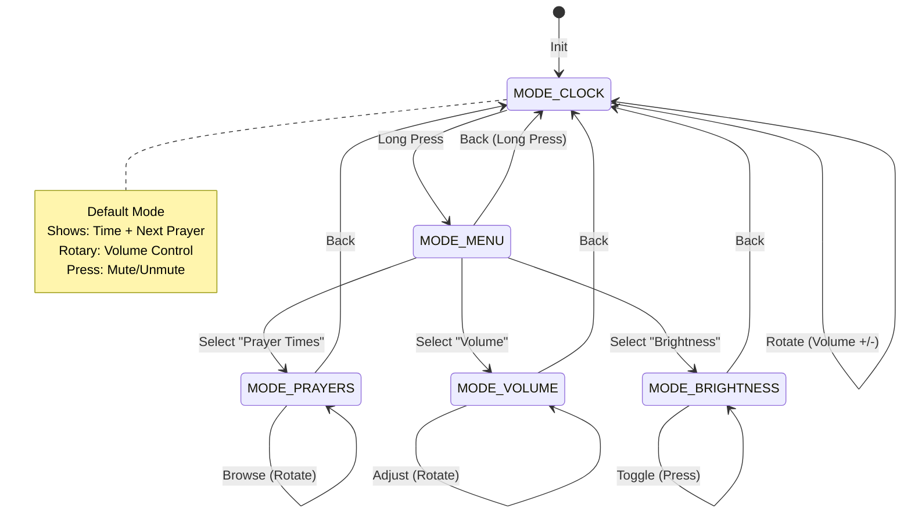

# ESP Prayer System - System Flow Diagram

## 1. Initialization Flow (setup)

```mermaid
flowchart TD
    START["🔌 Power On / Reset"] --> SERIAL["Initialize Serial<br/>115200 baud"]
    SERIAL --> VERSION["Print Version Info<br/>v1.0.0"]
    VERSION --> STORAGE["Mount LittleFS<br/>Load config.json"]
    STORAGE --> SETTINGS["Load Settings<br/>Validate & Clamp"]
    SETTINGS --> WIFI{"WiFi Connected?"}

    WIFI -->|"Yes (STA Mode)"| IP["Get IP Address"]
    WIFI -->|"No / Timeout"| AP["Start AP Mode<br/>ESP-Prayer-Setup<br/>192.168.4.1"]

    IP --> WEB["Start Web Server<br/>Port 80"]
    AP --> WEB

    WEB --> NET_CHECK{"WiFi Connected?"}

    NET_CHECK -->|"Yes"| NET_INIT["Initialize Network Services"]
    NET_CHECK -->|"No"| HW_INIT

    NET_INIT --> OTA["OTA Ready<br/>ArduinoOTA"]
    OTA --> NTP["NTP Sync<br/>pool.ntp.org"]
    NTP --> TIME_OK{"Time Synced?"}

    TIME_OK -->|"Yes"| MQTT["MQTT Init<br/>Connect Broker"]
    TIME_OK -->|"No"| HW_INIT

    MQTT --> DFP["DFPlayer Init<br/>9600 baud"]
    DFP --> PRAYER["Prayer Init<br/>Calculate Times"]
    PRAYER --> DISP["Display Init<br/>LCD 16x2"]
    DISP --> MARK["Mark Network<br/>Services Ready"]

    MARK --> HW_INIT["Hardware Init<br/>Buzzer + Rotary"]
    HW_INIT --> TONE["Play Startup Tone"]
    TONE --> WIFI_TONE{"WiFi Connected?"}
    WIFI_TONE -->|"Yes"| CONN_TONE["Play WiFi Connected Tone"]
    WIFI_TONE -->|"No"| MENU_INIT
    CONN_TONE --> MENU_INIT["Rotary Menu Init"]
    MENU_INIT --> READY["✅ System Ready"]

    style START fill:#ff9800,color:#fff
    style READY fill:#4caf50,color:#fff
    style WIFI fill:#2196f3,color:#fff
    style NET_CHECK fill:#2196f3,color:#fff
    style TIME_OK fill:#2196f3,color:#fff
    style WIFI_TONE fill:#2196f3,color:#fff
```

## 2. Main Loop Flow

```mermaid
flowchart TD
    LOOP["🔄 Main Loop Start"] --> HW["hardware_loop()<br/>Read Encoder + Button<br/>Update Buzzer Tones"]
    HW --> WIFI_L["wifi_loop()<br/>Monitor Connection<br/>Reconnect if Needed"]

    WIFI_L --> WIFI_OK{"WiFi Connected?"}

    WIFI_OK -->|"Yes"| NET_CHECK{"Network<br/>Initialized?"}
    WIFI_OK -->|"No"| PRAYER_L

    NET_CHECK -->|"Yes"| OTA_H["OTA.handle()<br/>Process Updates"]
    NET_CHECK -->|"No"| TRY_INIT["Try Initialize<br/>Network Services"]

    OTA_H --> MQTT_L["mqtt_loop()<br/>Process Messages"]
    MQTT_L --> TIME_U["time_update()<br/>Refresh NTP Time"]

    TRY_INIT --> PRAYER_L
    TIME_U --> PRAYER_L

    PRAYER_L["prayer_loop()<br/>Check Prayer Times<br/>Trigger Azan/Iqama"]

    PRAYER_L --> MENU_L{"Network<br/>Initialized?"}
    MENU_L -->|"Yes"| RMENU["rotary_menu_loop()<br/>Process Input<br/>Update Display"]
    MENU_L -->|"No"| WEB_L

    RMENU --> WEB_L["web_server_loop()<br/>Handle HTTP Requests"]
    WEB_L --> LOOP

    style LOOP fill:#ff9800,color:#fff
    style WIFI_OK fill:#2196f3,color:#fff
    style NET_CHECK fill:#2196f3,color:#fff
    style MENU_L fill:#2196f3,color:#fff
```

## 3. Prayer Time Detection Flow

```mermaid
flowchart TD
    CHECK["prayer_loop()"] --> TIME{"Time Changed?"}

    TIME -->|"No"| SKIP["Skip"]
    TIME -->|"Yes"| DAY{"New Day?"}

    DAY -->|"Yes"| RECALC["Recalculate<br/>All Prayer Times"]
    DAY -->|"No"| FAJR{"Fajr Time?"}

    RECALC --> FAJR

    FAJR -->|"Yes & Not Played"| PLAY_AZAN_F["Play Azan<br/>Fajr"]
    FAJR -->|"No"| DHUHR{"Dhuhr Time?"}

    PLAY_AZAN_F --> IQAMA_F{"Iqama<br/>Delay Done?"}
    IQAMA_F -->|"Yes"| PLAY_IQAMA_F["Play Iqama<br/>Fajr"]

    DHUHR -->|"Yes & Not Played"| PLAY_AZAN_D["Play Azan<br/>Dhuhr"]
    DHUHR -->|"No"| ASR{"Asr Time?"}

    PLAY_AZAN_D --> IQAMA_D{"Iqama<br/>Delay Done?"}
    IQAMA_D -->|"Yes"| PLAY_IQAMA_D["Play Iqama<br/>Dhuhr"]

    ASR -->|"Yes & Not Played"| PLAY_AZAN_A["Play Azan<br/>Asr"]
    ASR -->|"No"| MAGHRIB{"Maghrib Time?"}

    PLAY_AZAN_A --> IQAMA_A{"Iqama<br/>Delay Done?"}
    IQAMA_A -->|"Yes"| PLAY_IQAMA_A["Play Iqama<br/>Asr"]

    MAGHRIB -->|"Yes & Not Played"| PLAY_AZAN_M["Play Azan<br/>Maghrib"]
    MAGHRIB -->|"No"| ISHA{"Isha Time?"}

    PLAY_AZAN_M --> IQAMA_M{"Iqama<br/>Delay Done?"}
    IQAMA_M -->|"Yes"| PLAY_IQAMA_M["Play Iqama<br/>Maghrib"]

    ISHA -->|"Yes & Not Played"| PLAY_AZAN_I["Play Azan<br/>Isha"]
    ISHA -->|"No"| ADHKAR

    PLAY_AZAN_I --> IQAMA_I{"Iqama<br/>Delay Done?"}
    IQAMA_I -->|"Yes"| PLAY_IQAMA_I["Play Iqama<br/>Isha"]

    ADHKAR["Check Adhkar<br/>(Morning/Evening)"] --> KAHF{"Friday?<br/>Al-Kahf Time?"}
    KAHF -->|"Yes"| PLAY_KAHF["Play Surah<br/>Al-Kahf"]
    KAHF -->|"No"| CUSTOM{"Custom Alert<br/>Time?"}
    CUSTOM -->|"Yes"| PLAY_CUSTOM["Play Custom<br/>Alert"]
    CUSTOM -->|"No"| SKIP

    PLAY_IQAMA_F --> SKIP
    PLAY_IQAMA_D --> SKIP
    PLAY_IQAMA_A --> SKIP
    PLAY_IQAMA_M --> SKIP
    PLAY_IQAMA_I --> SKIP
    PLAY_KAHF --> SKIP
    PLAY_CUSTOM --> SKIP

    style CHECK fill:#ff9800,color:#fff
    style TIME fill:#2196f3,color:#fff
    style DAY fill:#2196f3,color:#fff
```

## 4. Rotary Menu State Machine

```mermaid
stateDiagram-v2
    [*] --> MODE_CLOCK: Init

    MODE_CLOCK --> MODE_MENU: Long Press
    MODE_CLOCK --> MODE_CLOCK: Short Press (Mute/Unmute)
    MODE_CLOCK --> MODE_CLOCK: Rotate (Volume +/-)

    MODE_MENU --> MODE_PRAYERS: Select "Prayer Times"
    MODE_MENU --> MODE_VOLUME: Select "Volume"
    MODE_MENU --> MODE_BRIGHTNESS: Select "Brightness"
    MODE_MENU --> MODE_CLOCK: Back (Long Press)

    MODE_PRAYERS --> MODE_CLOCK: Back
    MODE_PRAYERS --> MODE_PRAYERS: Browse (Rotate)

    MODE_VOLUME --> MODE_CLOCK: Back
    MODE_VOLUME --> MODE_VOLUME: Adjust (Rotate)

    MODE_BRIGHTNESS --> MODE_CLOCK: Back
    MODE_BRIGHTNESS --> MODE_BRIGHTNESS: Toggle (Press)

    note right of MODE_CLOCK
        Default Mode
        Shows: Time + Next Prayer
        Rotary: Volume Control
        Press: Mute/Unmute
    end note
```
